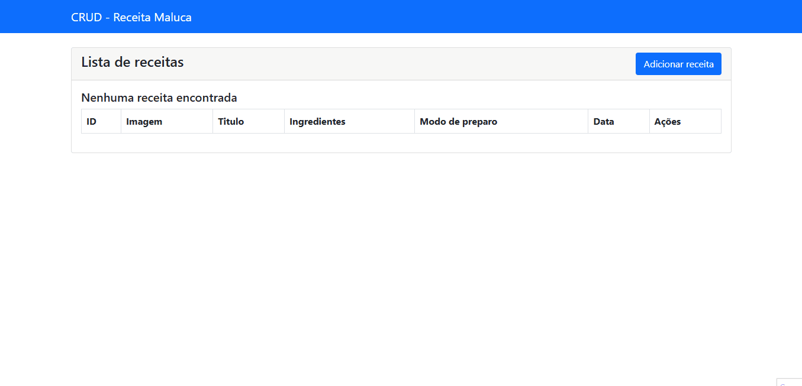

<h1 align="center">
CRUD - Desenvolvimento Web
</h1>

<p align="center">Está é uma aplicação desenvolvida com PHP, Bootstrap e MySql</p>

<div align="center" >
  
 
</div>

---

# Tecnologias

- PHP 7.4
- MySql 5.7
- Bootstrap@5.0.2
- Bootstrap-icons@1.11.3

# Para executar o projeto

```bash
# subir php e mysql
$ docker-compose up -d

```

```bash
# verifique se não a erros logs
$ docker-compose logs -f

```

# Para criar a tabela:

```
CREATE TABLE `tb_receita` (
  `id` int(11) NOT NULL AUTO_INCREMENT,
  `titulo` varchar(255) NOT NULL,
  `ingredientes` varchar(255) NOT NULL,
  `data` date NOT NULL,
  `modo_preparo` varchar(255) NOT NULL,
  `imagem` varchar(255) DEFAULT NULL,
  PRIMARY KEY (`id`)
) ENGINE=InnoDB AUTO_INCREMENT=10 DEFAULT CHARSET=latin1;

```

# criando receita:

imagem:

https://s2-receitas.glbimg.com/vGqO-xbCN2RQQO13DP1Z9-pV0N4=/0x0:1280x800/984x0/smart/filters:strip_icc()/i.s3.glbimg.com/v1/AUTH_1f540e0b94d8437dbbc39d567a1dee68/internal_photos/bs/2021/9/N/bmnJNgR5G0K2QmEYFkPQ/bolo-de-cenoura-receita.jpg

titulo:

Bolo de Cenoura

ingredientes:

exemplo: 1/2 xícara (chá) de óleo, 3 cenouras médias raladas, 4 ovos, 2 xícaras (chá) de açúcar, 2 e 1/2 xícaras (chá) de farinha de trigo...

modo_preparo:

Modo de preparo : 40min Massa: Em um liquidificador, adicione a cenoura, os ovos e o óleo, depois misture. crescente o açúcar e bata novamente por 5 minutos
